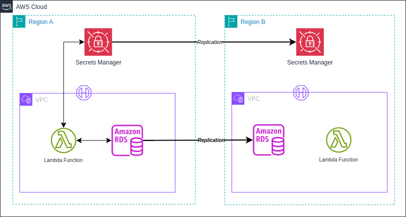

# **Módulo Terraform: cloudops-ref-repo-aws-sm-terraform**

## Descripción:

Este módulo facilita la creación y gestión de secretos en AWS Secrets Manager con todas las mejores prácticas de seguridad, nomenclatura y configuración según los estándares. Permite crear secretos con cifrado obligatorio, políticas de acceso personalizadas y soporte para replicación entre regiones.

Consulta CHANGELOG.md para la lista de cambios de cada versión. *Recomendamos encarecidamente que en tu código fijes la versión exacta que estás utilizando para que tu infraestructura permanezca estable y actualices las versiones de manera sistemática para evitar sorpresas.*

## Diagrama



## Características

- ✅ Creación de múltiples secretos usando mapas de objetos
- ✅ Opción para crear solo la estructura del secreto sin contenido sensible
- ✅ Soporte para secretos en formato JSON o texto plano (opcional)
- ✅ Cifrado obligatorio mediante AWS KMS
- ✅ Replicación de secretos entre regiones
- ✅ Políticas de acceso integradas en la configuración del secreto
- ✅ Etiquetado consistente según estándares organizacionales
- ✅ Validaciones de entrada para prevenir configuraciones incorrectas

## Estructura del Módulo
El módulo cuenta con la siguiente estructura:

```bash
cloudops-ref-repo-aws-sm-terraform/
└── sample/
    ├── data.tf
    ├── main.tf
    ├── outputs.tf
    ├── providers.tf
    ├── terraform.auto.tfvars
    └── variables.tf
├── .gitignore
├── CHANGELOG.md
├── data.tf
├── main.tf
├── outputs.tf
├── README.md
├── variables.tf
```

- Los archivos principales del módulo (`data.tf`, `main.tf`, `outputs.tf`, `variables.tf`) se encuentran en el directorio raíz.
- `CHANGELOG.md` y `README.md` también están en el directorio raíz para fácil acceso.
- La carpeta `sample/` contiene un ejemplo de implementación del módulo.

## Provider Configuration

Este módulo requiere la configuración de un provider específico para el proyecto. Debe configurarse de la siguiente manera:

```hcl
# sample/providers.tf
provider "aws" {
  alias   = "principal"
  region  = var.aws_region
  profile = var.profile
  
  default_tags {
    tags = var.common_tags
  }
}

# sample/main.tf
module "secrets_manager" {
  source = "../"
  providers = {
    aws.project = aws.principal
  }
  # ... resto de la configuración
}
```

## Uso del Módulo:

```hcl
module "secrets_manager" {
  source = "ruta/al/modulo"
  
  providers = {
    aws.project = aws.principal
  }

  # Common configuration
  client      = "pragma"
  project     = "idp"
  environment = "dev"
  additional_tags = {
    backup-policy = "none"
    service-tier  = "standard"
  }

  # Configuración de secretos
  secrets_config = {
    # Secreto básico sin replicación
    "db-credentials" = {
      description           = "Credenciales de base de datos"
      kms_key_id            = "alias/aws/secretsmanager"
      create_secret_version = false
      policy = <<EOF
{
  "Version": "2012-10-17",
  "Statement": [
    {
      "Effect": "Allow",
      "Principal": {
        "AWS": "arn:aws:iam::123456789012:root"
      },
      "Action": [
        "secretsmanager:GetSecretValue",
        "secretsmanager:DescribeSecret"
      ],
      "Resource": "*"
    }
  ]
}
EOF
      additional_tags = {
        application = "database"
        data-classification = "confidential"
      }
    },
    
    # Secreto con replicación en múltiples regiones
    "multi-region-secret" = {
      description           = "Secreto replicado en múltiples regiones"
      kms_key_id            = "alias/aws/secretsmanager"
      replica = [
        {
          region     = "us-west-2"
          kms_key_id = "alias/aws/secretsmanager"
        },
        {
          region     = "eu-west-1"
          kms_key_id = "alias/aws/secretsmanager"
        }
      ]
      create_secret_version = false
      policy = <<EOF
{
  "Version": "2012-10-17",
  "Statement": [
    {
      "Effect": "Allow",
      "Principal": {
        "AWS": "arn:aws:iam::123456789012:root"
      },
      "Action": [
        "secretsmanager:GetSecretValue",
        "secretsmanager:DescribeSecret"
      ],
      "Resource": "*"
    }
  ]
}
EOF
      additional_tags = {
        application = "global-app"
        replication = "multi-region"
      }
    }
  }
}
```

## Convenciones de nomenclatura

El módulo sigue un estándar de nomenclatura para los secretos:

```
{client}/{project}/{environment}/secret/{secret_name}
```

Por ejemplo:
- `pragma/idp/dev/secret/db-credentials`
- `pragma/payments/prod/secret/api-keys`

## Etiquetado

El módulo maneja el etiquetado de la siguiente manera:

1. **Etiquetas obligatorias**: Se aplican a través del provider AWS usando `default_tags` en la configuración del provider.
   ```hcl
   provider "aws" {
     default_tags {
       tags = {
         environment = "dev"
         project-name = "idp"
         cost-center = "cloud-ops"
         owner = "cloudops"
         area = "infrastructure"
         provisioned = "terraform"
         datatype = "operational"
       }
     }
   }
   ```

2. **Etiqueta Name**: Se genera automáticamente siguiendo el estándar de nomenclatura para cada secreto.

3. **Etiquetas adicionales por recurso**: Se pueden especificar etiquetas adicionales para cada secreto individualmente mediante el atributo `additional_tags` en la configuración de cada secreto.

## Monitoreo y auditoría

> **Nota importante**: Este módulo no incluye la creación de alarmas CloudWatch. Para monitorear y auditar el acceso a los secretos, se recomienda:
>
> 1. **Configurar AWS CloudTrail**: Las operaciones de Secrets Manager se registran automáticamente en CloudTrail, lo que permite auditar quién accedió a qué secretos y cuándo.
>
> 2. **Implementar un módulo de CloudWatch separado**: Para crear alarmas y métricas personalizadas que monitoreen el acceso a los secretos.
>
> 3. **Habilitar AWS Config**: Para evaluar continuamente la configuración de los secretos y asegurar el cumplimiento de las políticas de seguridad.

## Requirements

| Name | Version |
|------|---------|
| <a name="requirement_terraform"></a> [terraform](#requirement\_terraform) | >= 1.0.0 |
| <a name="requirement_aws"></a> [aws](#requirement\_aws) | >= 4.31.0 |

## Providers

| Name | Version |
|------|---------|
| <a name="provider_aws.project"></a> [aws.project](#provider\_aws) | >= 4.31.0 |

## Resources

| Name | Type |
|------|------|
| [aws_secretsmanager_secret](https://registry.terraform.io/providers/hashicorp/aws/latest/docs/resources/secretsmanager_secret) | resource |
| [aws_secretsmanager_secret_version](https://registry.terraform.io/providers/hashicorp/aws/latest/docs/resources/secretsmanager_secret_version) | resource (opcional) |
| [aws_secretsmanager_secret_policy](https://registry.terraform.io/providers/hashicorp/aws/latest/docs/resources/secretsmanager_secret_policy) | resource (opcional) |

## Variables

| Name | Description | Type | Default | Required |
|------|-------------|------|---------|:--------:|
| <a name="client"></a> [client](#input\client) | Identificador del cliente | `string` | n/a | yes |
| <a name="project"></a> [project](#input\project) | Nombre del proyecto o aplicación que utilizará el secreto | `string` | n/a | yes |
| <a name="environment"></a> [environment](#input\environment) | Entorno de despliegue (dev, qa, pdn) | `string` | n/a | yes |
| <a name="additional_tags"></a> [additional_tags](#input\additional_tags) | Etiquetas adicionales para los recursos que no son secretos | `map(string)` | `{}` | no |
| <a name="secrets_config"></a> [secrets_config](#input\secrets_config) | Configuración de secretos en AWS Secrets Manager | `map(object)` | n/a | yes |

### Estructura de `secrets_config`

```hcl
variable "secrets_config" {
  type = map(object({
    description                     = string
    kms_key_id                      = string  # Obligatorio para garantizar el cifrado
    recovery_window_in_days         = optional(number, 7)
    force_overwrite_replica_secret  = optional(bool, true)
    replica = optional(list(object({
      region     = string
      kms_key_id = string
    })), [])
    # Campos opcionales para el contenido del secreto
    secret_json                     = optional(map(string))
    secret_text                     = optional(string)
    # Flag para controlar si se crea la versión del secreto
    create_secret_version           = optional(bool, false)
    # Política del secreto (opcional)
    policy                          = optional(string)
    # Etiquetas adicionales
    additional_tags                 = optional(map(string), {})
  }))
}
```

## Outputs

| Name | Description |
|------|-------------|
| <a name="secret_arns"></a> [secret_arns](#output\secret_arns) | ARNs de los secretos creados |
| <a name="secret_names"></a> [secret_names](#output\secret_names) | Nombres de los secretos creados |
| <a name="secret_versions"></a> [secret_versions](#output\secret_versions) | IDs de las versiones de los secretos creados (solo para secretos con versión) |

## Gestión de secretos después de la creación

Después de crear la estructura del secreto con `create_secret_version = false`, puede agregar el contenido sensible de varias maneras:

### 1. Usando AWS Console

1. Inicie sesión en la consola de AWS
2. Navegue a AWS Secrets Manager
3. Seleccione el secreto creado
4. Haga clic en "Retrieve secret value" y luego en "Edit"
5. Ingrese el valor del secreto y guarde los cambios

### 2. Usando AWS CLI

```bash
# Para secretos en formato JSON
aws secretsmanager put-secret-value \
    --secret-id "pragma/idp/dev/secret/db-credentials" \
    --secret-string '{"username":"admin","password":"SecurePassword123!","host":"db.example.com","port":"5432"}'

# Para secretos en formato texto
aws secretsmanager put-secret-value \
    --secret-id "pragma/idp/dev/secret/api-key" \
    --secret-string "api-key-value-here"
```

### 3. Usando automatizaciones

- Integre con herramientas de CI/CD como Jenkins, GitHub Actions o AWS CodeBuild
- Utilice AWS Lambda para gestionar los secretos
- Implemente soluciones como HashiCorp Vault para la gestión centralizada de secretos

## Replicación de secretos entre regiones

La replicación de secretos entre regiones es útil para:

1. **Alta disponibilidad**: Asegura que los secretos estén disponibles incluso si una región de AWS falla
2. **Baja latencia**: Permite que las aplicaciones accedan a los secretos desde la región más cercana
3. **Recuperación ante desastres**: Facilita la recuperación en caso de un desastre regional

Para configurar la replicación, use el campo `replica` en la configuración del secreto:

```hcl
replica = [
  {
    region     = "us-west-2"
    kms_key_id = "alias/aws/secretsmanager"  # KMS key en la región secundaria
  },
  {
    region     = "eu-west-1"
    kms_key_id = "alias/aws/secretsmanager"  # KMS key en la región terciaria
  }
]
```

**Notas importantes sobre la replicación:**

- Cada región de réplica debe tener su propia KMS key
- Las actualizaciones al secreto se propagan automáticamente a todas las réplicas
- Las políticas de acceso se aplican a todas las réplicas

## Rotación de secretos (Versión futura)

La rotación automática de secretos es una característica importante para la seguridad, pero requiere una función Lambda específica para cada tipo de secreto. En esta versión del módulo, la rotación automática no está implementada.

En una versión futura, se planea agregar soporte completo para la rotación automática de secretos, incluyendo:

- Módulo complementario para crear funciones Lambda de rotación
- Plantillas para diferentes tipos de secretos (bases de datos, APIs, etc.)
- Integración con servicios de AWS como RDS, Redshift, etc.

Si necesita implementar la rotación de secretos, considere:

1. Crear una función Lambda personalizada para la rotación
2. Configurar la rotación manualmente a través de la consola de AWS
3. Utilizar un módulo separado para la rotación de secretos

## Consideraciones de seguridad

- Se requiere utilizar una KMS key para cifrar los secretos (puede ser la clave predeterminada de AWS o una personalizada)
- Configurar políticas de acceso restrictivas siguiendo el principio de privilegio mínimo
- Revisar regularmente los logs de CloudTrail para auditar el acceso a los secretos
- Considerar la replicación de secretos críticos en múltiples regiones para alta disponibilidad
- **Nunca almacenar datos sensibles en el código Terraform o en sistemas de control de versiones**

## Mejores Prácticas Implementadas

- **Seguridad**: Cifrado en reposo obligatorio con AWS KMS
- **Nomenclatura**: Estándar {client}/{project}/{environment}/secret/{secret_name}
- **Etiquetado**: Etiquetas completas según política (environment, project, owner, client) a través de `default_tags`
- **Modularización**: Estructura modular y reutilizable
- **Gestión de secretos**: Opción para crear secretos sin contenido sensible

## Configuración del Backend

> **Recomendación importante**: Para entornos de producción y colaboración en equipo, se recomienda configurar un backend remoto para almacenar el estado de Terraform (tfstate). Esto proporciona:
>
> - Bloqueo de estado para prevenir operaciones concurrentes
> - Respaldo y versionado del estado
> - Almacenamiento seguro de información sensible
> - Colaboración en equipo
>
> Ejemplo de configuración con S3 y DynamoDB:
>
> ```hcl
> terraform {
>   backend "s3" {
>     bucket         = "pragma-terraform-states"
>     key            = "secrets-manager/terraform.tfstate"
>     region         = "us-east-1"
>     encrypt        = true
>     dynamodb_table = "terraform-locks"
>   }
> }
> ```
>
> Asegúrese de que el bucket S3 tenga el versionado habilitado y que la tabla DynamoDB tenga una clave primaria llamada `LockID`.

## Lista de verificación de cumplimiento

- [x] Nomenclatura de recursos conforme al estándar
- [x] Etiquetas obligatorias aplicadas a todos los recursos
- [x] Cifrado en reposo obligatorio con KMS
- [x] Políticas de acceso personalizables e integradas
- [x] Opción para crear secretos sin contenido sensible
- [x] Soporte para replicación entre regiones
- [x] Documentación sobre cómo gestionar secretos de forma segura
- [ ] Monitoreo y alertas (debe implementarse con el módulo CloudWatch)
- [x] Revisión de seguridad completada

Este módulo ha sido desarrollado siguiendo los estándares de Pragma CloudOps, garantizando una implementación segura, escalable y optimizada que cumple con todas las políticas de la organización. Pragma CloudOps recomienda revisar este código con su equipo de infraestructura antes de implementarlo en producción.
